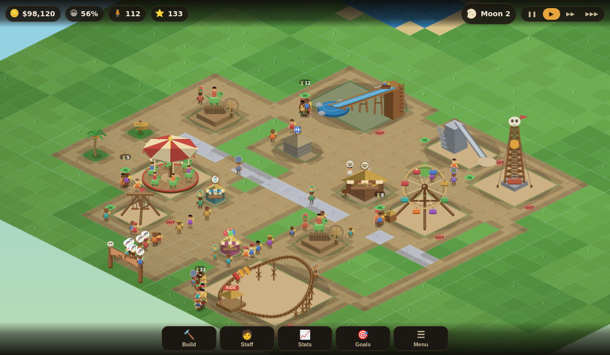
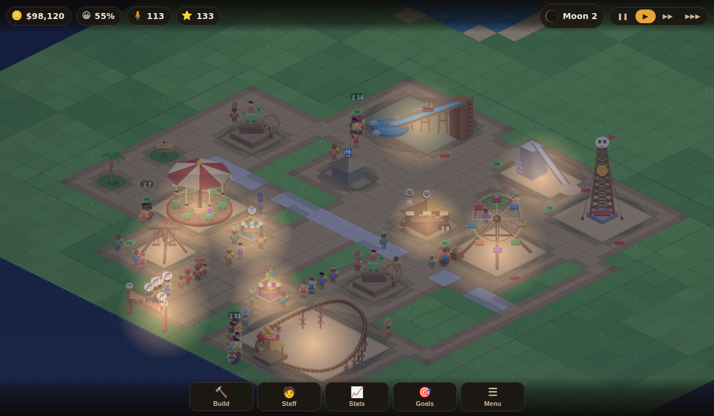

# Prehistoric Fun Park — browser remake

A from-scratch, browser-based remake of the stone-age theme-park management game
that shipped on Nokia J2ME phones around 2007. Build paths, raise rides, hire
staff, set prices, and keep a crowd of hungry, thirsty, easily-bored cave people
happy enough to keep paying.

Runs on a phone or a desktop browser. No build step, no dependencies.



Every moon brings a night, when the torches and stalls light the paths:



## Play it

Open `index.html` in a browser, or serve the folder:

```bash
python3 -m http.server 8000     # then open http://localhost:8000
```

The game saves to `localStorage` automatically at every new moon, and from
**Menu → Save park**.

## Controls

| | |
|---|---|
| Move around | drag, or arrow keys / WASD |
| Zoom | pinch, scroll wheel, or `+` / `-` |
| Build | **Build** button, then tap the map. Paths can be painted by dragging |
| Rotate a ride | **Rotate** in the build bar, or `R` |
| Inspect | tap a ride, a shop, a worker — or any visitor |
| Cancel | `Esc`, or right-click |
| Pause / speed | the buttons top right, or `Space` |
| Sell what's selected | `Delete` |

## How the park works

* **Visitors only walk on paths.** Pave a route out of the gate first. Stone paths
  are more comfortable than gravel.
* **Every ride has an IN and an OUT tile**, shown in the build preview before you
  pay. Both must touch a path or nobody can ride.
* **Big rides need power** — a Dino Treadmill within range, with a Dino Rider
  hired to turn it.
* **Shops need staff**: a salesman for the snack bar, juice hut and balloons, a
  cook for the cafe, a shaman for the aid post.
* **Visitors have needs** — hunger, thirst, toilet, energy, health and fun — plus
  a purse and a mood. Tap one to see exactly what they are carrying and thinking.
  Unhappy visitors start fights unless a guard is nearby.
* **Prices matter.** Charge more than a ride is worth and people pay, but sulk.
* **Rides wear out and break down.** A repairman walks over and fixes them.
* **Every new moon is a month**: wages and upkeep come out, and the month's
  figures land in the Statistics panel. New rides get invented as the months pass.
* **Park rating** — built from size, ride variety and quality, comfort and average
  happiness — decides how many visitors turn up.

Meet all four objectives (cash, visitors, happiness, working rides) and the tribe
makes you chief.

## Project layout

```
index.html          markup and script order
css/style.css       HUD, panels, build sheet, responsive layout
js/data.js          tile/grid constants, the building and staff catalogues
js/util.js          maths, colour and isometric helpers
js/sprites.js       sprite cache + shared drawing primitives
js/art-rides.js     artwork and animation for the rides
js/art-props.js     artwork for shops, the treadmill and scenery
js/park.js          the grid: terrain, placement rules, power, path finding
js/agents.js        visitor and staff behaviour
js/sim.js           clock, money, ride cycles, statistics, save/load
js/render.js        isometric renderer, ground cache, day/night lighting
js/ui.js            HUD, build menu, inspector panels, statistics charts
js/main.js          input handling and the frame loop
```

### Notes on the rendering

Everything you see is drawn with canvas primitives — there are no image files in
this project. Each building is rendered once into an offscreen canvas and cached
by art id, footprint and rotation; moving parts (wheels, swings, water, the
coaster train) are drawn live on top. The ground is baked into a single canvas
and repainted one tile at a time when you build, which keeps path painting smooth
on a phone (~0.2 ms per tile versus ~7 ms for a full rebake).

## Provenance

This is an independent tribute, not a port. *Prehistoric Fun Park* (2007) was
published by THQ Wireless and developed by Gear Games for J2ME phones; the
original `.jar` was used only to confirm which game this was and to read its
in-game help text, which describes the mechanics. No original code, artwork,
text or data from that game is included here, and the in-game power source is a
"Dino Treadmill" rather than the original's own term. All trademarks belong to
their owners.

`docs/theme-park-game-identification-chat.txt` is the conversation that tracked
the game down.
