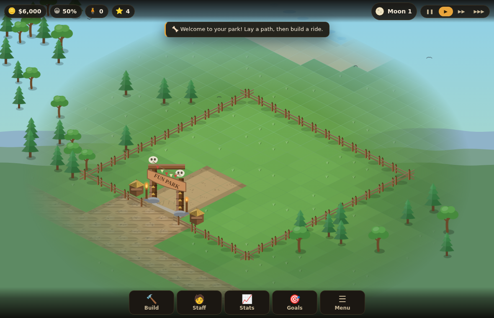
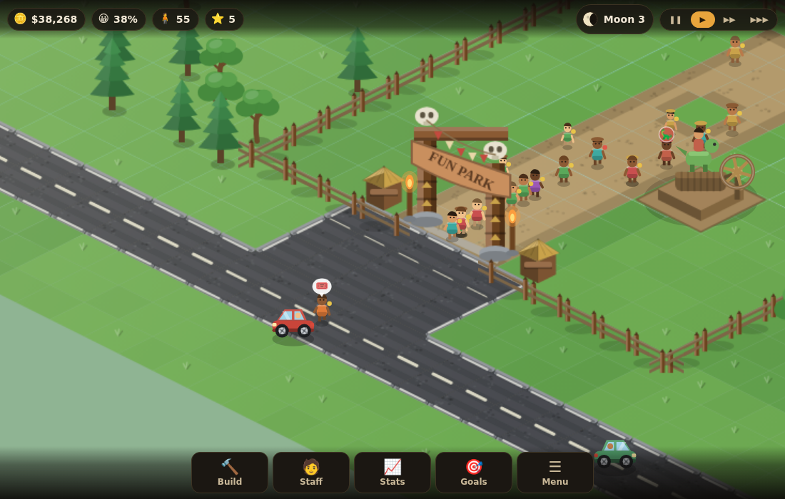
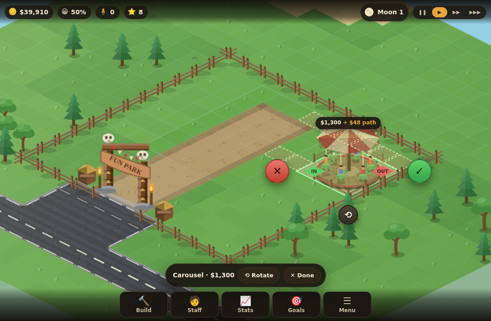
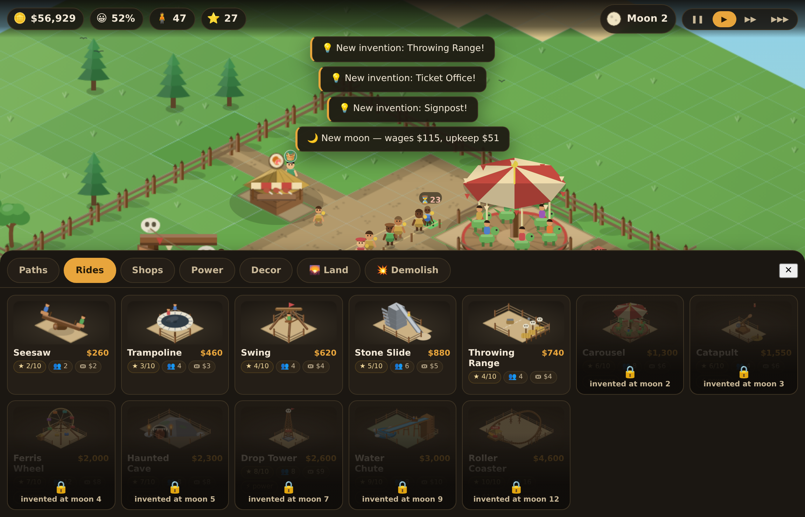
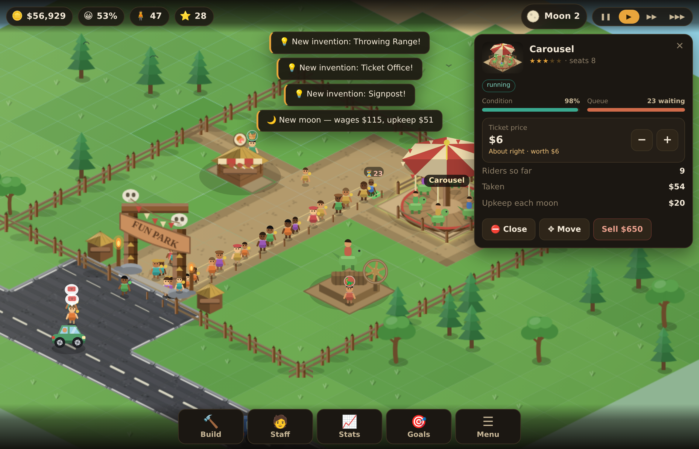

# Prehistoric Fun Park — browser remake

A from-scratch, browser-based remake of the stone-age theme-park management game
that shipped on Nokia J2ME phones around 2007. You start with a small fenced
clearing by the road, and buy the valley back from the forest one plot at a time
as the money comes in. Build paths, raise rides, hire staff, set prices, and keep
a crowd of hungry, thirsty, easily-bored cave people happy enough to keep paying.

Runs on a phone, a tablet or a desktop browser. No build step, no dependencies.


You begin with four plots — a clearing, a gateway and the road:



Cars, minibuses and coaches queue on the tarmac outside and set visitors down at
the gateway; nothing on wheels comes inside the park:



Nothing is built by a stray tap. Drag a ride out of the tray or slide it around
the map; the ghost carries a price tag, a tick, a cross and a rotate button, and
the little run of path needed to reach its doors is quoted and laid with it.



The tray shows each ride as it will actually look, with its rating, capacity and
ticket price; picking one open its panel so the price can be set straight away.




## Play it

Open `index.html` in a browser, or serve the folder:

```bash
python3 -m http.server 8000     # then open http://localhost:8000
```

The game saves to `localStorage` automatically at every new moon, and from
**Menu → Save park**.

## Controls

| | |
|---|---|
| Move around | drag, or arrow keys / WASD |
| Zoom | pinch, scroll wheel, or `+` / `-` |
| Build | **Build** button, then tap the map. Paths can be painted by dragging |
| Buy land | **Build → 🌄 Land**, then tap a marked plot |
| Place it | drag it out of the tray, or tap the map and slide it; then the green ✓ (or `Enter`). ✕ picks another spot, ⟲ rotates |
| Move something | **press and hold it, then drag** — or select it and use **✥ Move**. Free, either way |
| Demolish | **Build → 💥 Demolish**, then tap. Drag to clear a run of paving; half the cost comes back |
| Rotate a ride | **Rotate** in the build bar, or `R` |
| Inspect | tap a ride, a shop, a worker — or any visitor |
| Cancel | `Esc`, or right-click |
| Pause / speed | the buttons top right, or `Space` |
| Sell what's selected | `Delete` |

## How the park works

* **You only own a clearing to begin with.** Land is bought a 6×6 plot at a time
  from the **Land** tab; each plot costs more than the last, and buying one clears
  the forest and moves the palisade out. You can only build on land you own.
* **Visitors arrive by road.** A metalled two-lane road runs past the park, with
  kerbs, edge lines and a dashed centre line, and an apron up to the gateway.
  Cars, minibuses and coaches pull up there, set their passengers down and queue
  behind one another while they unload — a coach when a crowd is due, a car when
  it is quiet. Visitors walk in under the banner; vehicles never come inside.
  People going home walk back out and wait at the roadside for a lift.
* **Visitors only walk on paths.** Pave a route out of the gate first. Stone paths
  are more comfortable than gravel.
* **Every ride has an IN and an OUT tile**, shown in the build preview before you
  pay. Both must touch a path or nobody will ride: a doorway with no path beside
  it is marked **IN?** / **OUT?** on the doorway itself, so you can see which one
  still needs connecting.
* **Big rides need power** — a Dino Treadmill within range, with a Dino Rider
  hired to turn it.
* **Shops need staff**: a salesman for the snack bar, juice hut and balloons, a
  cook for the cafe, a shaman for the aid post.
* **Visitors have needs** — hunger, thirst, toilet, energy, health and fun — plus
  a purse and a mood. Tap one to see exactly what they are carrying and thinking.
  Unhappy visitors start fights unless a guard is nearby.
* **Prices matter.** Charge more than a ride is worth and people pay, but sulk.
* **Every ride is fenced** with a gap at its entrance and exit, so a ride nobody
  can reach is obvious at a glance, and the queue forms an orderly roped lane
  running back from the entrance.
* **Rides wear out and break down.** A repairman walks over and fixes them.
* **Anything can be picked up and moved** — ride, shop, treadmill or bench — with
  its takings, price and condition intact, and put back if you change your mind.
  Press and hold it to lift it, drag it where you want it, then confirm.
* **Every new moon is a month**: wages and upkeep come out, and the month's
  figures land in the Statistics panel. New rides get invented as the months pass.
* **Park rating** — built from size, ride variety and quality, comfort and average
  happiness — decides how many visitors turn up.

Meet all four objectives (cash, visitors, happiness, working rides) and the tribe
makes you chief.

## Project layout

```
index.html          markup and script order
css/style.css       HUD, panels, build sheet, responsive layout
js/data.js          tile/grid constants, the building and staff catalogues
js/util.js          maths, colour and isometric helpers
js/sprites.js       sprite cache + shared drawing primitives
js/art-rides.js     artwork and animation for the rides
js/art-props.js     artwork for shops, the treadmill and scenery
js/park.js          the grid: land plots, terrain, placement rules, power, paths
js/scenery.js       the wild valley: procedural terrain, forest, volcano, palisade
js/traffic.js       the road: carts, wagons and mammoth buses, and their artwork
js/agents.js        visitor and staff behaviour
js/sim.js           clock, money, ride cycles, statistics, save/load
js/render.js        isometric renderer, ground cache, day/night lighting
js/ui.js            HUD, build menu, inspector panels, statistics charts
js/main.js          input handling and the frame loop
```

## Playing on a phone or tablet

The camera opens closer in on a small screen so people and rides stay legible and
tappable; drag to scroll, pinch to zoom (the point between your fingers stays
put), and the build sheet gets out of the way once you have picked something. The
HUD, dock, panels and build sheet have their own phone, tablet and landscape
layouts, and everything clears the notch and home indicator.

Long-press belongs to the game, not the browser: the callout menu, text selection
and magnifier are all suppressed over the map, and holding a building picks it up
instead.

## On frameworks

There is still no framework, and that is a deliberate call rather than inertia:
the renderer is already the cheap part (cached sprites, a baked ground layer,
one depth-sorted pass), and the UI is a few hundred lines of DOM. React or a
game engine would add a build step and a dependency tree without making anything
here faster or simpler. The two thresholds worth watching: if the park ever needs
thousands of moving sprites or real lighting, that is the moment for **PixiJS**
(WebGL batching, same canvas-style API); if the panels grow into genuinely
stateful screens — a research tree, a staff roster with filters — that is the
moment for a small view layer. Neither is true yet.

### Notes on the rendering

Everything you see is drawn with canvas primitives — there are no image files in
this project. Each building is rendered once into an offscreen canvas and cached
by art id, footprint and rotation; moving parts (wheels, swings, water, the
coaster train) are drawn live on top. The ground is baked into a single canvas
and repainted one tile at a time when you build, which keeps path painting smooth
on a phone (~0.2 ms per tile versus ~7 ms for a full rebake).

That layer only covers the land you own plus a ring of wild country around it, and
is rebuilt a size larger when you buy a plot — a new park bakes 1792×904 px rather
than the 3712×1864 px the whole valley would need. Rather than fading the edge
out, the camera is fenced: panning is clamped to the land, and the zoom-out floor
is computed so the park always fills the screen, so the edge simply never comes
into view. Both loosen as you buy land. The scenery standing on that ground is
depth-sorted into the same pass as the rides and the crowd.

Nights are switched off for the moment (`sim.nightCycle = false`); the lighting
pass and the torch glows are still there behind the flag.

## Provenance

This is an independent tribute, not a port. *Prehistoric Fun Park* (2007) was
published by THQ Wireless and developed by Gear Games for J2ME phones; the
original `.jar` was used only to confirm which game this was and to read its
in-game help text, which describes the mechanics. No original code, artwork,
text or data from that game is included here, and the in-game power source is a
"Dino Treadmill" rather than the original's own term. All trademarks belong to
their owners.

`docs/theme-park-game-identification-chat.txt` is the conversation that tracked
the game down.
